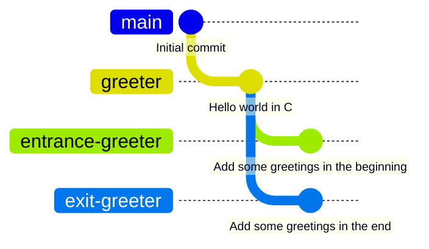
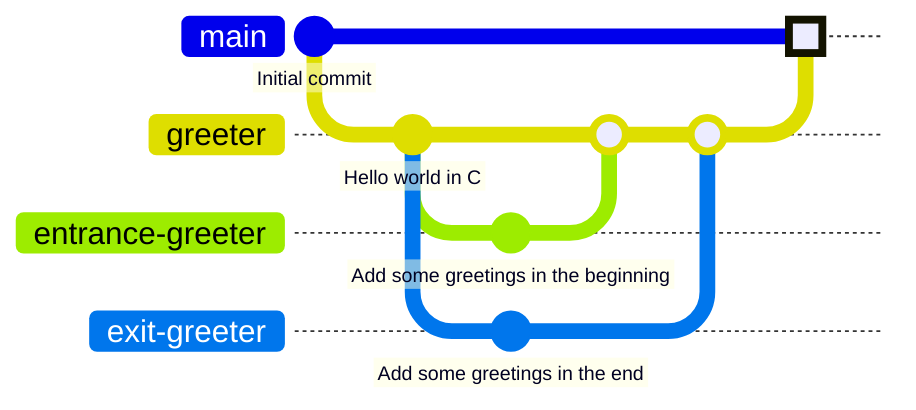
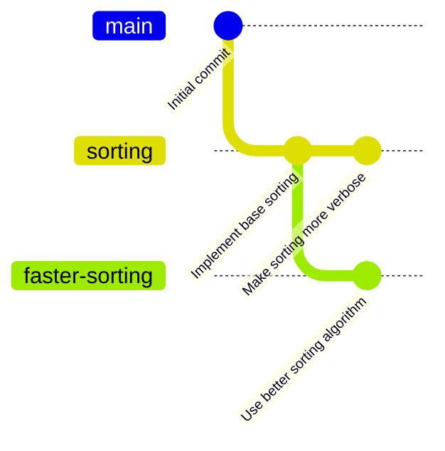
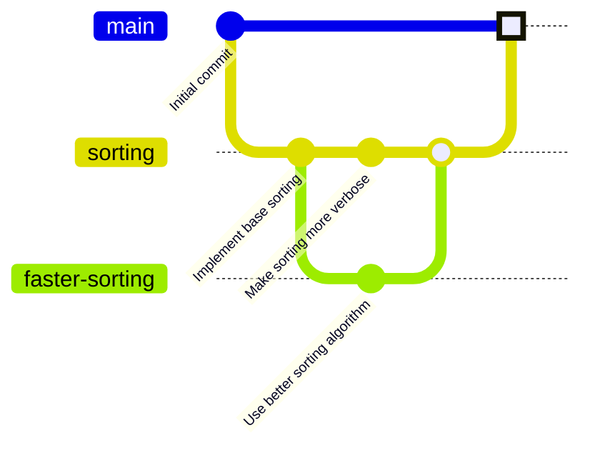
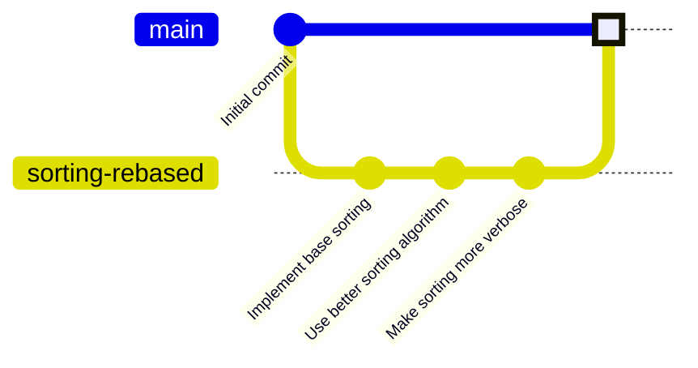
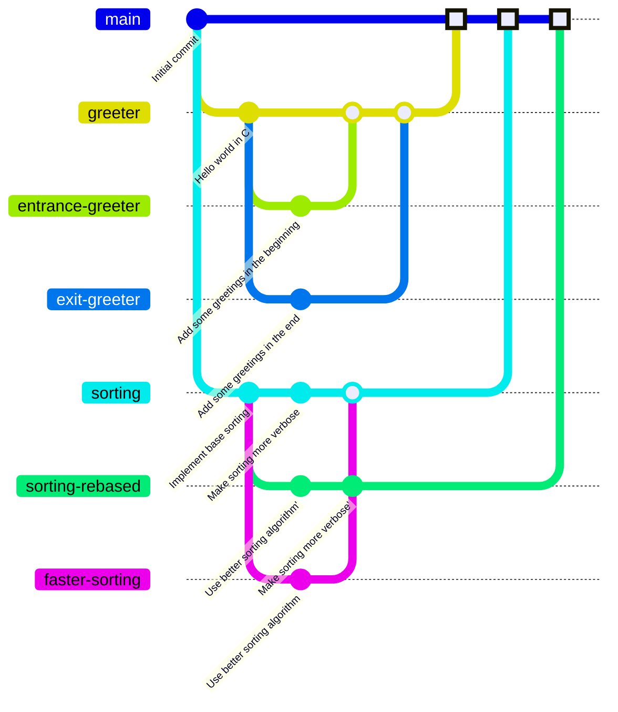

# Знакомство с Git


[](https://xkcd.com/1296/)

Все задания в данном разделе подразумевают манипуляцию с коммитами и ветками в текущем репозитории.

## Подготовка

Репозиторий данного задания в GitHub Classroom является [fork](https://docs.github.com/en/pull-requests/collaborating-with-pull-requests/working-with-forks/about-forks)'ом (копией)
некоторого *upstream* репозитория [nsu-syspro/mpt-git-basics](https://github.com/nsu-syspro/mpt-git-basics).

По умолчанию *fork* копирует только основную ветку [main](https://github.com/nsu-syspro/mpt-git-basics/tree/main).
Однако, для выполнения следующих заданий потребуется синхронизовать все ветки из *upstream* репозитория в текущий.

<details>
  <summary>Подробные инструкции</summary>

1. Добавить `upstream` репозиторий, как *remote* и сделать `fetch`:
   ```console
   $ git remote add upstream git@github.com:nsu-syspro/mpt-git-basics.git
   $ git fetch upstream
   remote: Enumerating objects: 26, done.
   remote: Counting objects: 100% (26/26), done.
   remote: Compressing objects: 100% (20/20), done.
   remote: Total 25 (delta 5), reused 21 (delta 1), pack-reused 0
   Unpacking objects: 100% (25/25), 2.26 KiB | 289.00 KiB/s, done.
   From github.com:nsu-syspro/mpt-git-basics
    * [new branch]      entrance-greeter -> upstream/entrance-greeter
    * [new branch]      exit-greeter     -> upstream/exit-greeter
    * [new branch]      faster-sorting   -> upstream/faster-sorting
    * [new branch]      greeter          -> upstream/greeter
    * [new branch]      main             -> upstream/main
    * [new branch]      sorting          -> upstream/sorting
   ```
   После этого можно убедиться, что все `upstream` ветки теперь видны в локальномрепозитории:
   ```console
   $ git branch --remotes
     origin/HEAD -> origin/main
     origin/main
     upstream/entrance-greeter
     upstream/exit-greeter
     upstream/faster-sorting
     upstream/greeter
     upstream/main
     upstream/sorting
   ```
1. Затем нужно опубликовать все ветки из `upstream` в `origin`:
   ```console
   $ git push origin "refs/remotes/upstream/*:refs/heads/*"
   Total 0 (delta 0), reused 0 (delta 0), pack-reused 0 (from 0)
   To github.com:nsu-syspro/mpt-git-basics-<your-github-username>.git
    * [new branch]      upstream/entrance-greeter -> entrance-greeter
    * [new branch]      upstream/exit-greeter -> exit-greeter
    * [new branch]      upstream/faster-sorting -> faster-sorting
    * [new branch]      upstream/greeter -> greeter
    * [new branch]      upstream/sorting -> sorting
    ! [rejected]        upstream/main -> main (non-fast-forward)
   error: failed to push some refs to 'github.com:nsu-syspro/mpt-git-basics-<your-github-username>.git'
   hint: Updates were rejected because the tip of your current branch is behind
   hint: its remote counterpart. If you want to integrate the remote changes,
   hint: use 'git pull' before pushing again.
   hint: See the 'Note about fast-forwards' in 'git push --help' for details.
   ```
   > Так как ветка `origin/main` в текущем репозитории опережает `upstream/main`,
   > то Git нам не дал ее таким образом перезаписать (что хорошо).  
   > Есть способы *форсировать* такую перезапись, но для целей данного задания
   > нам это не понадобится --- достаточно синхронизации всех остальных веток.
   
   Теперь осталось убедиться, что интересующие нас ветки попали в `origin`:
   ```console
   $ git branch --remote
     origin/HEAD -> origin/main
     origin/entrance-greeter
     origin/exit-greeter
     origin/faster-sorting
     origin/greeter
     origin/main
     origin/sorting
     upstream/entrance-greeter
     upstream/exit-greeter
     upstream/faster-sorting
     upstream/greeter
     upstream/main
     upstream/sorting
   ```
1. Далее рекомендуется удалить `upstream` *remote* из локального репозитория,
   чтобы не мешался в дальнейшем (оригинальный репозиторий на GitHub останется без изменений):
   ```console
   $ git remote remove upstream
   ```

   > При работе с несколькими *remote* репозиториями, могут возникнуть сложности
   > при переключении веток:
   > ```console
   > $ git switch greeter
   > hint: If you meant to check out a remote tracking branch on, e.g. 'origin',
   > hint: you can do so by fully qualifying the name with the --track option:
   > hint: 
   > hint:     git checkout --track origin/<name>
   > hint: 
   > hint: If you'd like to always have checkouts of an ambiguous <name> prefer
   > hint: one remote, e.g. the 'origin' remote, consider setting
   > hint: checkout.defaultRemote=origin in your config.
   > ```
   > Как подсказывает сам Git, при первом переключении на ветку, если она уже существует
   > в нескольких *remote* репозиториях, нужно явно указать из какого репозитория
   > брать ветку с помощью опции `--track origin/<name>` у `git checkout` или
   > *более современной команды* `git switch`:
   > ```console
   > $ git switch --track origin/greeter
   > branch 'greeter' set up to track 'origin/greeter'.
   > Switched to a new branch 'greeter'
   > ```

</details>

## Задание №1 (3 балла)

В текущем репозитории на подготовительном шаге были добавлены ветка `greeter`
и растущие из нее ответвления `entrance-greeter` и `exit-greeter`, содержащие
различающиеся реализации `HelloWorld` программы на языке Си.




> При работе с ветками, удобно визуализировать их с помощью графического Git-клиента
> или с помощью команды `git log` с фильтрацией интересующих веток:
> ```console
> $ git log --graph --oneline --glob='*greeter'
> * eb3bde4 (origin/exit-greeter) Add some greetings in the end
> | * 79725ea (origin/entrance-greeter) Add some greetings in the beginning
> |/  
> * f96bdde (origin/greeter) Hello world in C
> * a6172c7 Initial commit
> ```

Требуется произвести слияние веток *без разрешения конфликтов*:

- Влить `entrance-greeter` и `exit-greeter` в `greeter`
- Влить полученную ветку `greeter` в `main`

<details>
  <summary>Подробные инструкции</summary>

1. Перейти на ветку `greeter`
   ```console
   $ git switch greeter
   branch 'greeter' set up to track 'origin/greeter'.
   Switched to a new branch 'greeter'
   ```
1. Влить ветки `entrance-greeter` и `exit-greeter` в ветку `greeter`
   (конфликтов быть не должно)
   ```console
   $ git merge --no-ff origin/entrance-greeter 
   Merge made by the 'ort' strategy.
    src/hello.c | 1 +
    1 file changed, 1 insertion(+)
   $ git merge --no-ff origin/exit-greeter 
   Auto-merging src/hello.c
   Merge made by the 'ort' strategy.
    src/hello.c | 1 +
    1 file changed, 1 insertion(+)
   ```
   > Аргумент `--no-ff` нужен, чтобы гарантировать создание коммита слияния,
   > даже если вливаемая ветка растет напрямую из текущей. В такой ситуации
   > по умолчанию коммит слияния не создается, а текущая ветка просто переставляется
   > на вливаемую (так называемый *fast-forward merge*).
1. Убедиться, что программа работает правильно (хоть явных конфликтов и не было,
   слияние двух версий всегда может внести неявные конфликты):
   ```console
   $ gcc src/hello.c -o src/a.out
   $ ./src/a.out 
   Good morning and ...
   Hello world!
   ... and good bye!
   ```
1. Опубликовать полученную ветку `greeter`
   ```console
   $ git push
   Total 0 (delta 0), reused 0 (delta 0), pack-reused 0 (from 0)
   To github.com:nsu-syspro/mpt-git-basics-<your-github-username>.git
      f96bdde..a22ffca  greeter -> greeter
   ```
1. Перейти на ветку `main`
   ```console
   $ git switch main
   Switched to branch 'main'
   Your branch is up to date with 'origin/main'.
   ```
1. Затем влить полученную ветку `greeter` в `main`
   ```console
   $ git merge greeter 
   Merge made by the 'ort' strategy.
    src/.gitignore | 1 +
    src/hello.c    | 8 ++++++++
    2 files changed, 9 insertions(+)
    create mode 100644 src/.gitignore
    create mode 100644 src/hello.c
   ```
1. Опубликовать ветку `main` в `origin`
   ```console
   $ git push
   Enumerating objects: 17, done.
   Counting objects: 100% (17/17), done.
   Delta compression using up to 12 threads
   Compressing objects: 100% (7/7), done.
   Writing objects: 100% (7/7), 1007 bytes | 1007.00 KiB/s, done.
   Total 7 (delta 1), reused 0 (delta 0), pack-reused 0 (from 0)
   remote: Resolving deltas: 100% (1/1), completed with 1 local object.
   To github.com:nsu-syspro/mpt-git-basics-<your-github-username>.git
      40cbe11..5262815  main -> main
   ```

</details>

В итоге должна получиться примерно следующая иерархия веток:


## Задание №2 (3 балла)

В текущем репозитории на подготовительном шаге были добавлены ветка `sorting` и
ее ответвление `faster-sorting`, содержащие различные реализации сортировки на
языке Python.



Требуется произвести слияние веток *с разрешением конфликтов*:

- Влить `faster-sorting` в `sorting`
- Влить полученную ветку `sorting` в `main`

<details>
  <summary>Подробные инструкции</summary>

1. Перейти на ветку `sorting`, где сначала была реализована сортировка, а затем
   было добавлено логирование каждого сравнения элементов
   ```console
   $ git switch sorting
   Switched to branch 'sorting'
   Your branch is up to date with 'origin/sorting'.
   ```
1. Влить ветку `faster-sorting`, где был реализован другой (возможно, более быстрый)
   алгоритм сортировки, в ветку `sorting`
   ```console
   $ git merge origin/faster-sorting
   Auto-merging src/sort.py
   CONFLICT (content): Merge conflict in src/sort.py
   Automatic merge failed; fix conflicts and then commit the result.
   ```
1. Разрешить возникший конфликт: чтобы использовался алгоритм сортировки из
   версии `faster-sorting` и при этом логировались сравнения, как в версии `sorting`.
   > Если в процессе разрешения конфликтов что-то пошло не так и требуется
   > начать процесс слияния заново, то прервать слияние и откатиться к исходному
   > состоянию можно с помощью команды
   > ```console
   > $ git merge --abort
   > ```
1. После разрешения конфликта добавить измененный файл и продолжить слияние:
   ```console
   $ git add src/sort.py
   $ git merge --continue
   [sorting 9a7a3a9] Merge remote-tracking branch 'origin/faster-sorting' into sorting
   ```
1. Убедиться, что программа работает правильно после разрешения конфликтов:
   ```console
   $ python3 src/sort.py
   comparing 40 and 4
   comparing 40 and 20
   comparing 4 and 20
   comparing 40 and 10
   comparing 20 and 10
   comparing 4 and 10
   comparing 40 and 30
   comparing 20 and 30
   comparing 40 and 6
   comparing 30 and 6
   comparing 20 and 6
   comparing 10 and 6
   comparing 4 and 6
   comparing 40 and 10
   comparing 30 and 10
   comparing 20 and 10
   comparing 10 and 10
   [4, 6, 10, 10, 20, 30, 40]
   ```
   > Если что-то пошло не так, то рекомендуется провести процесс слияния и разрешения
   > конфликтов заново.
   > Для этого достаточно установить текущую ветку `sorting` в исходное положение:
   > ```console
   > $ git reset --hard origin/sorting
   > HEAD is now at f96816b Make sorting more verbose
   > ```
   > И затем повторить слияние веток.
1. Опубликовать полученную ветку `sorting`
   ```console
   $ git push
   Total 0 (delta 0), reused 0 (delta 0), pack-reused 0 (from 0)
   To github.com:nsu-syspro/mpt-git-basics-<your-github-username>.git
      f96816b..9a7a3a9  sorting -> sorting
   ```
1. Перейти на ветку `main`
   ```console
   $ git switch main
   Switched to branch 'main'
   Your branch is up to date with 'origin/main'.
   ```
1. Затем влить полученную ветку `sorting` в `main`
   ```console
   $ git merge sorting
   Merge made by the 'ort' strategy.
    src/sort.py | 16 ++++++++++++++++
    1 file changed, 16 insertions(+)
    create mode 100644 src/sort.py
   ```
1. Опубликовать ветку `main` в `origin`
   ```console
   $ git push
   Enumerating objects: 15, done.
   Counting objects: 100% (15/15), done.
   Delta compression using up to 12 threads
   Compressing objects: 100% (6/6), done.
   Writing objects: 100% (7/7), 828 bytes | 828.00 KiB/s, done.
   Total 7 (delta 2), reused 0 (delta 0), pack-reused 0 (from 0)
   remote: Resolving deltas: 100% (2/2), completed with 2 local objects.
   To github.com:nsu-syspro/mpt-git-basics-<your-github-username>.git
      5262815..8c69217  main -> main
   ```

</details>

В итоге должна получиться примерно следующая иерархия веток:


## Задание №3 (4 балла)

> **Рекомендуется** выполнять это задание после задания №2

Вместо слияния веток из задания №2 с созданием коммита-слияния и не-линейной историей,
можно воспользоваться перебазированием (`git rebase`) и получить новую линейную
историю, как проиллюстрировано ниже.



Требуется создать "линеаризированную" версию ветки `sorting` --- ветку `sorting-rebased`,
в которой коммиты упорядочены так, что сначала был реализован улучшенный
алгоритм сортировки, а затем добавлено логирование:

- Перебазировать `faster-sorting` на `sorting`, создав новую ветку `sorting-rebased`
- Поменять местами два последних коммита в `sorting-rebased`
- Влить полученную ветку `sorting-rebased` в `main`

<details>
  <summary>Подробные инструкции</summary>

1. Перейти на ветку `sorting` и создать новую ветку `sorting-rebased`
   > Можно выполнить одной командой
   > ```console
   > $ git switch -c sorting-rebased sorting
   > Switched to a new branch 'sorting-rebased'
   > ```
1. Также, для демонстрации некоторых особенностей, следует опубликовать созданную ветку:
   ```console
   $ git push -u origin sorting-rebased
   Total 0 (delta 0), reused 0 (delta 0), pack-reused 0 (from 0)
   remote: 
   remote: Create a pull request for 'sorting-rebased' on GitHub by visiting:
   remote:      https://github.com/nsu-syspro/mpt-git-basics-<your-github-username>/pull/new/sorting-rebased
   remote: 
   To github.com:nsu-syspro/mpt-git-basics-<your-github-username>.git
    * [new branch]      sorting-rebased -> sorting-rebased
   branch 'sorting-rebased' set up to track 'origin/sorting-rebased'.
   ```
1. Установить ветку на `faster-sorting`
   ```console
   $ git reset --hard faster-sorting
   HEAD is now at e7a8f53 Use better sorting algorithm
   ```
   > Иерархия на данном этапе должна быть примерно такая:
   > ```mermaid
   > ---
   > config:
   >   gitGraph:
   >     parallelCommits: true
   >     rotateCommitLabel: true
   > ---
   > gitGraph:
   >    commit id: "Initial commit"
   >    branch sorting
   >    commit id: "Implement base sorting"
   >    branch faster-sorting
   >    commit id: "Use better sorting algorithm" type: HIGHLIGHT tag: "sorting-rebased"
   >    checkout sorting
   >    commit id: "Make sorting more verbose"
   > 
   >    checkout sorting
   >    merge faster-sorting
   > 
   >    checkout main
   >    merge sorting
   > ```
1. Перебазировать текущую ветку `sorting-rebased` на оригинальную версию сортировки
   с логированием (до коммита слияния):
   ```console
   $ git rebase sorting~1
   Auto-merging src/sort.py
   CONFLICT (content): Merge conflict in src/sort.py
   error: could not apply e7a8f53... Use better sorting algorithm
   hint: Resolve all conflicts manually, mark them as resolved with
   hint: "git add/rm <conflicted_files>", then run "git rebase --continue".
   hint: You can instead skip this commit: run "git rebase --skip".
   hint: To abort and get back to the state before "git rebase", run "git rebase --abort".
   Could not apply e7a8f53... Use better sorting algorithm
   ```
   > Добавление `~1` к названию ветки или коммиту указывает на *первого* предка
   > данного коммита.
   > То есть в данном случае `sorting~1` указывает действительно на коммит,
   > в котором было добавлено логирование:
   > ```console
   > $ git log --graph --oneline sorting
   > *   9a7a3a9 (origin/sorting, sorting) Merge remote-tracking branch 'origin/faster-sorting' into sorting
   > |\  
   > | * e7a8f53 (HEAD -> sorting-rebased, origin/faster-sorting) Use better sorting algorithm
   > * | f96816b Make sorting more verbose
   > |/  
   > * 69079b4 Implement base sorting
   > * a6172c7 Initial commit
   > $ git log --oneline -n 1 sorting~1
   > f96816b Make sorting more verbose
   > ```
1. Разрешить возникший конфликт: чтобы использовался алгоритм сортировки из
   версии `faster-sorting` и при этом логировались сравнения.
   > Если в процессе разрешения конфликтов что-то пошло не так и требуется
   > перебазироваться заново, то прервать *rebase* и откатиться к исходному
   > состоянию можно с помощью команды
   > ```console
   > $ git rebase --abort
   > ```
1. После разрешения конфликта добавить измененный файл и продолжить *rebase*:
   ```console
   $ git add src/sort.py
   $ git rebase --continue
   [detached HEAD e92f823] Use better sorting algorithm
    1 file changed, 12 insertions(+), 8 deletions(-)
   Successfully rebased and updated refs/heads/sorting-rebased.
   ```
   > В итоге должна получиться линейная история коммитов:
   > ```console
   > $ git log --graph --oneline
   > * 799162f (HEAD -> sorting-rebased) Use better sorting algorithm
   > * f96816b Make sorting more verbose
   > * 69079b4 Implement base sorting
   > * a6172c7 Initial commit
   > ```
1. Убедиться, что программа работает правильно после разрешения конфликтов.
   > Если что-то пошло не так, то рекомендуется провести процесс перебазирования
   > и разрешения конфликтов заново.
   > Для этого достаточно установить текущую ветку `sorting-rebased` в исходное положение:
   > ```console
   > $ git reset --hard origin/faster-sorting
   > HEAD is now at e7a8f53 Use better sorting algorithm
   > ```
   > И затем повторить *rebase*.
1. Теперь остается переставить два последних коммита с разрешением конфликтов:
   ```console
   $ git rebase --interactive HEAD~2
   ```
   > `HEAD~2` указывает на второго предка текущего коммита:
   > ```console
   > $ git log --oneline -n 1 HEAD~2
   > 69079b4 Implement base sorting
   > ```
   В открывшемся редакторе необходимо переставить местами строки соответствующие
   перебазируемым коммитам:
   ```
   pick f96816b Make sorting more verbose
   pick 799162f Use better sorting algorithm
   ```
   > Если в качестве редактора по умолчанию выбран Vim (`EDITOR=vim`), то достаточно
   > набрать `ddp:wq`.

   После редактирования сценария перебазирования, необходимо дважды разрешить
   конфликты (в обоих коммитах) таким образом, чтобы в первом коммите появился
   новый алгоритм сортировки, но без логирования, а во втором добавилось
   логирование в новый алгоритм.

   > После разрешения каждого конфликта необходимо добавить измененный файл и продолжить *rebase*:
   > ```console
   > $ git add src/sort.py
   > $ git rebase --continue
   > ...
   > ```
1. Как обычно, после разрешения конфликтов рекомендуется проверить, что программа 
   все еще работает корректно.
   > Либо если у вас сохранена какая-либо версия с предыдущим разрешением
   > конфликтов, то можно просто посмотреть разницу полученного результата с этой
   > версией. В данном случае, в ветке `sorting` уже были разрешены конфликты, и
   > в результате всех проделанных манипуляций код не должен был поменяться:
   > ```console
   > $ git diff sorting
   > $
   > ```
1. Если теперь попробовать опубликовать полученную ветку `sorting-rebased`, то
   столкнемся с ошибкой:
   ```console
   $ git push
   To github.com:nsu-syspro/mpt-git-basics-<your-github-username>.git
    ! [rejected]        sorting-rebased -> sorting-rebased (non-fast-forward)
   error: failed to push some refs to 'github.com:nsu-syspro/mpt-git-basics-<your-github-username>.git'
   hint: Updates were rejected because the tip of your current branch is behind
   hint: its remote counterpart. If you want to integrate the remote changes,
   hint: use 'git pull' before pushing again.
   hint: See the 'Note about fast-forwards' in 'git push --help' for details.
   ```
   Git сервер отказался принять локальную ветку `sorting-rebased`, потому что
   она не является продолжением уже опубликованной версии `origin/sorting-rebased`:
   ```console
   $ git log --graph --oneline sorting-rebased origin/sorting-rebased
   * 05547ee (HEAD -> sorting-rebased) Make sorting more verbose
   * d58097f Use better sorting algorithm
   | *   9a7a3a9 (origin/sorting-rebased, origin/sorting, sorting) Merge remote-tracking branch 'origin/faster-sorting' into sorting
   | |\  
   | | * e7a8f53 (origin/faster-sorting) Use better sorting algorithm
   | |/  
   |/|   
   | * f96816b Make sorting more verbose
   |/  
   * 69079b4 Implement base sorting
   * a6172c7 Initial commit
   ```
   В такой ситуации обычно производится слияние с опубликованной версией
   ```console
   $ git merge origin/sorting-rebased
   ...
   ```
   либо перебазирование
   ```console
   $ git rebase origin/sorting-rebased
   ...
   ```
   Но в данном задании необходимо именно переписать опубликованную историю так,
   чтобы она полностью заменилась на локальную версию. Такое переписывание делается
   с помощью следующей команды:
   ```console
   $ git push --force-with-lease 
   Enumerating objects: 11, done.
   Counting objects: 100% (11/11), done.
   Delta compression using up to 12 threads
   Compressing objects: 100% (6/6), done.
   Writing objects: 100% (8/8), 881 bytes | 881.00 KiB/s, done.
   Total 8 (delta 1), reused 0 (delta 0), pack-reused 0 (from 0)
   remote: Resolving deltas: 100% (1/1), done.
   To github.com:nsu-syspro/mpt-git-basics-<your-github-username>.git
    + 9a7a3a9...05547ee sorting-rebased -> sorting-rebased (forced update)
   ```
   > **Осторожно**  
   > Опция `--force-with-lease` *форсирует* переписывание истории на публичном
   > сервере, что является *чрезвычайно опасным* действием, особенно, если
   > с репозиторием работают другие люди кроме вас, которые могли базироваться
   > на ветке, историю которой вы изменяете.
1. Остается только влить изменения в ветку `main` и опубликовать ее (чтобы
   автоматическая система оценивания засчитала баллы за задание)
   ```console
   $ git switch main
   Switched to branch 'main'
   Your branch is up to date with 'origin/main'.
   $ git merge sorting-rebased
   Merge made by the 'ort' strategy.
   $ git push
   Enumerating objects: 1, done.
   Counting objects: 100% (1/1), done.
   Writing objects: 100% (1/1), 235 bytes | 235.00 KiB/s, done.
   Total 1 (delta 0), reused 0 (delta 0), pack-reused 0 (from 0)
   To github.com:liontiger23/mpt-git-basics-test.git
      8c69217..55b856c  main -> main
   ```

</details>

В итоге после выполнения всех заданий должна получиться примерно следующая иерархия веток:

